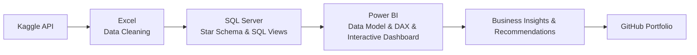
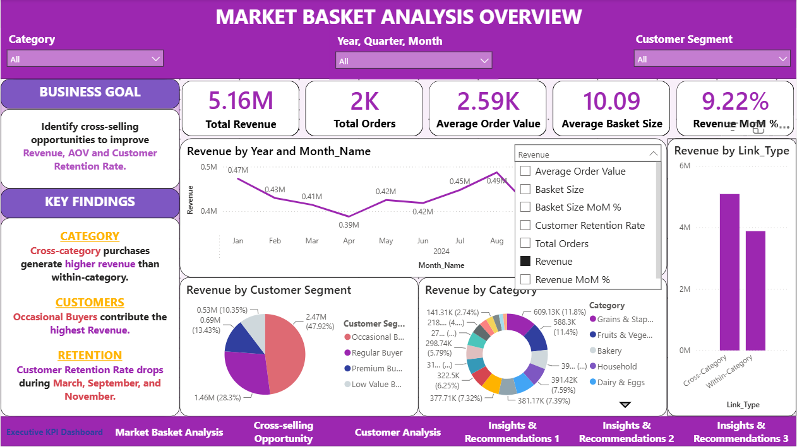
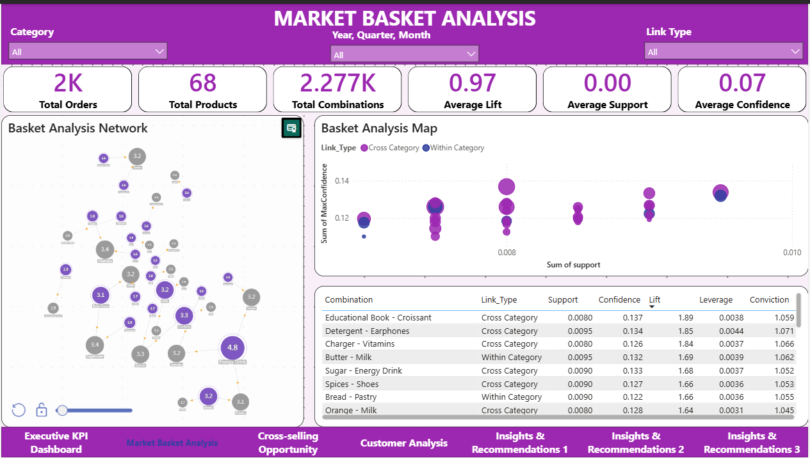
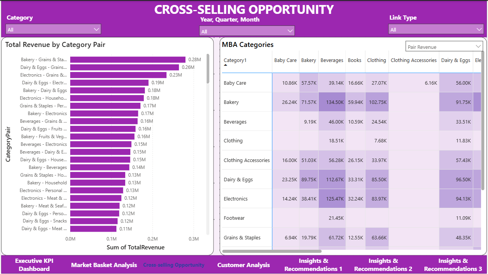
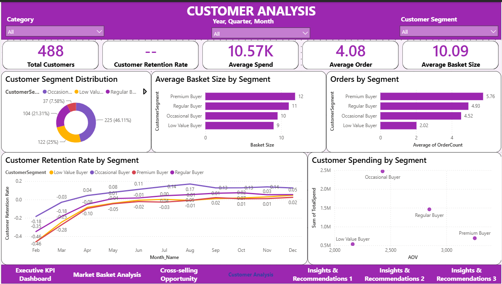

# 🛒 Retail Market Basket Analysis

Business-oriented Market Basket Analysis using SQL Server, Power BI, DAX and Excel to identify purchasing patterns, customer behavior and cross-selling opportunities.

## Project Overview

This project analyzes a simulated retail transaction dataset to uncover customer purchasing behavior and generate actionable business recommendations.

The analysis combines **Market Basket Analysis (MBA)**, **Customer Segmentation**, and **Business Intelligence dashboards** to answer three key business questions:

- How can **cross-selling opportunities** increase overall **Revenue**?
- How can **Revenue**, **Average Order Value (AOV)**, and **Customer Retention Rate (CRR)** be improved?
- Which **customer segments** generate the highest business value?

## Business Problem

Retail businesses generate thousands of daily transactions, but valuable purchasing patterns often remain hidden.

Without understanding which products are frequently purchased together or which customer segments create the greatest business value, merchandising decisions, promotional campaigns, and product recommendations are often based on intuition rather than data.

This project applies Market Basket Analysis (MBA) and Customer Segmentation to transform transactional data into actionable business insights.

## Business Questions

This project aims to answer the following business questions:

- Which product pairs create the strongest cross-selling opportunities?
- Which product categories contribute the highest revenue?
- Which customer segments generate the highest business value?
- How can Revenue, Average Order Value (AOV), Basket Size and Customer Retention Rate (CRR) be improved?

## Dataset
### Source
- [Retail POS Dataset for Market Basket Analysis](https://www.kaggle.com/datasets/arunsworkspace/retail-pos-dataset-for-market-basket-analysis)
## Dataset Overview

| Metric | Value |
|:----------------------|------:|
| Rows | 10,000 |
| Orders | 2,990 |
| Customers | 488 |
| Products | 68 |
| Categories | 13 |
| Total Revenue | 5.16M USD |

## Methodology

This project applies **Market Basket Analysis (MBA)**, a data mining technique used to discover associations between products that are frequently purchased together within transactional datasets. By identifying these purchasing patterns, businesses can better understand customer buying behavior and develop data-driven strategies for merchandising, product bundling, cross-selling, and promotional campaigns.

The analysis follows the **Association Rule Mining** approach, where each transaction is treated as a basket of purchased products. Product relationships are evaluated using several association-rule metrics, including **Support**, **Confidence**, **Lift**, **Leverage**, and **Conviction**. These metrics measure the frequency, strength, and reliability of product associations, allowing businesses to identify meaningful cross-selling opportunities beyond random co-occurrence.

In addition to product association analysis, the project incorporates **Customer Segmentation** and **Business Intelligence (BI)** techniques to evaluate customer purchasing behavior, monitor key business KPIs, and translate analytical findings into actionable business recommendations.

## Metrics & Formulas

### Association Rule Metrics

| Metric | Formula | Business Meaning |
|:-------|:--------|:-----------------|
| **Support** | Pair Count ÷ Total Orders | Measures how frequently two products are purchased together in transaction data. |
| **Confidence (A → B)** | Pair Count ÷ Orders containing Product A | Probability of purchasing Product B after Product A. |
| **Confidence (B → A)** | Pair Count ÷ Orders containing Product B | Probability of purchasing Product A after Product B. |
| **Lift** | Confidence (A → B) ÷ Support(Product B) | Measures the strength of association compared with random chance. Lift > 1 indicates a positive relationship. |
| **Leverage** | Support(A,B) − Support(A) × Support(B) | Evaluate whether the occurrence of a pair of items is more "reasonable" than their occurrence independently. Leverage > 0 indicates a positive relationship. |
| **Conviction** | (1 − Support(B)) ÷ (1 − Confidence (A → B)) | Measures the dependency of Product B on Product A. Higher values indicate stronger directional relationships. |

### Business Metrics

| Metric | Formula | Business Meaning |
|:-------|:--------|:-----------------|
| **Revenue** | Σ Total Amount | Total sales generated during the selected period. |
| **Average Order Value (AOV)** | Revenue ÷ Total Orders | Average amount spent per transaction. |
| **Average Basket Size** | Total Quantity Sold ÷ Total Orders | Average number of products purchased in each order. |
| **Revenue MoM %** | (Current Revenue − Previous Revenue) ÷ Previous Revenue | Measures monthly revenue growth trend. |
| **Pair Revenue** | Revenue(Product A) + Revenue(Product B) | Total revenue generated by a frequently purchased product pair. |
| **Revenue Contribution** | Pair Revenue ÷ Total Revenue | Percentage contribution of a product pair to overall revenue. |
| **Total Spend per Customer** | Σ(total_amount) by customer | Total amount spent by an individual customer across all purchases. |
| **Customer Retention Rate (CRR)** | (End Customers - New Customers) ÷ Start Customers | Percentage of existing customers who remained active from the previous period, excluding newly acquired customers. |

### Customer Segmentation

Customers were segmented using a **rule-based approach** based on two purchasing behavior metrics:

- **Total Spend**
- **Average Basket Size**

Both metrics were ranked into quartiles using the SQL Server `NTILE(4)` window function. A combined score was then used to classify customers into four business-oriented segments.

| Segment | Description |
|:--------|:------------|
| **Premium Buyer** | Highest Total Spend and largest Average Basket Size. |
| **Regular Buyer** | Above-average spending with relatively large basket sizes. |
| **Occasional Buyer** | Moderate spending and basket sizes, representing the largest customer group. |
| **Low Value Buyer** | Lowest spending and smallest basket sizes. |

This segmentation enables the business to compare customer value, purchasing behavior, and retention performance across different customer groups.

## Workflow

### 1. Data Collection (Kaggle)

- Downloaded the simulated retail transaction dataset using the **Kaggle**.
- Verified the dataset structure and exported the raw data for analysis.

### 2. Data Preparation (Microsoft Excel)

- Cleaned and validated the dataset using **Microsoft Excel**.
- Applied **Pivot Tables** and **XLOOKUP** to calculate and extract the necessary columns to prepare the dataset for import into the database.

### 3. Database Design & Business Logic (SQL Server Management Studio 22)

- Designed a **Star Schema** consisting of Fact and Dimension tables.
- Imported the cleaned dataset into **SQL Server**.
- Developed SQL views for:
  - Market Basket Analysis metrics (Support, Confidence, Lift, Leverage, Conviction)
  - Customer Segmentation
  - Pair Revenue Analysis
- Created analytical views optimized for Power BI reporting.

### 4. Data Modeling & Dashboard Development (Power BI Desktop)

- Connected Power BI to SQL Server views.
- Built the semantic data model and managed table relationships.
- Developed DAX measures for business KPIs.
- Created four interactive dashboards:
  - Market Basket Analysis Overview
  - Market Basket Analysis
  - Cross-selling Opportunity
  - Customer Analysis

### 5. Business Analysis

- Answered key business questions related to **Revenue**, **Average Order Value (AOV)**, and **Customer Retention Rate (CRR)**.
- Identified cross-selling opportunities, customer purchasing patterns, and high-value customer segments.
- Proposed actionable business recommendations supported by measurable KPIs and OKRs.

### 6. Documentation & Version Control (GitHub)

- Organized SQL scripts, Power BI dashboards, reports, and project documentation.
- Published the complete project on **GitHub** for portfolio presentation and version control.

## Features

- **Retail Performance Overview**
  - Monitor Revenue, Orders, Average Order Value (AOV), Basket Size, Revenue MoM, and Customer Retention Rate (CRR).

- **Market Basket Analysis**
  - Identify frequently purchased product pairs using Support, Confidence, Lift, Leverage, and Conviction.

- **Cross-selling Opportunity Analysis**
  - Analyze high-performing product categories relationships to support bundle recommendations and merchandising decisions.

- **Customer Segmentation**
  - Segment customers based on purchasing behavior into Premium Buyers, Regular Buyers, Occasional Buyers, and Low Value Buyers.

- **Interactive Power BI Dashboard**
  - Filter results dynamically by category, customer segment, and time period.

- **Business Recommendations**
  - Deliver data-driven insights and measurable OKRs for improving cross-selling effectiveness, customer retention, and revenue growth.

# Dashboard Overview

The Power BI dashboard is organized into four interactive pages, each designed to answer a specific business question. Users can explore the analysis dynamically using slicers for **Category**, **Time (Year/Quarter/Month)**, **Customer Segment**, and **Link Type**.

| Dashboard | Purpose |
|-----------|---------|
| **Executive KPI Dashboard** | Provides an overview of key business metrics including Revenue, Average Order Value (AOV), Average Basket Size, Revenue MoM %, and high-level business findings. |
| **Market Basket Analysis** | Examines product associations using Support, Confidence, Lift, Leverage, and Conviction to identify frequently purchased item pairs. |
| **Cross-selling Opportunity** | Identifies high-potential category pairs for merchandising optimization and cross-selling through Revenue Contribution and category relationship analysis. |
| **Customer Analysis** | Evaluates customer behavior across different segments using Customer Retention Rate (CRR), Average Spend, Average Basket Size, AOV, and purchasing patterns. |

---

## Dashboard Preview

### Executive KPI Dashboard

---

### Market Basket Analysis

---

### Cross-selling Opportunity

---

### Customer Analysis

---
